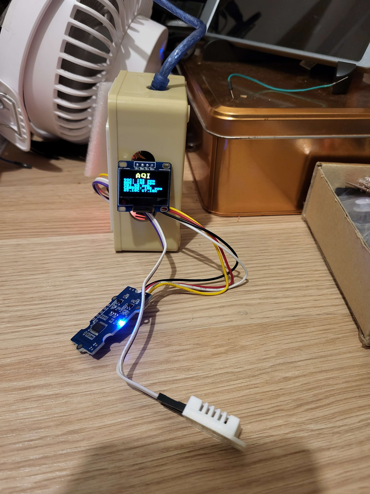

# Nano_Multichannel_OLED

A simple air quality sensor made of "spare parts" I had in my drawers: an Arduino Nano, a Nano base, a SeeedStudio Multichannel gas sensor, a small SSD1306 OLED, a button. And half of an enclosure,  the lid of which I can find...

